# 这是一份月神殿的wa插件导入字符串教程
## weakauras2(简称WA)简单介绍 
## 一款神级监控插件,你没这插件月光检查出来你就要挨喷 

--- 

+ # 第一步下载--2选1,官方和我提供的
+ # [weakauras2官方下载地址](https://www.curseforge.com/wow/addons/weakauras-2 "点我下载") 
+ # [我提供的WeakAuras-2.8.1版本下载]
(https://github.com/zxsean/Moon-Temple-WA/raw/master/wa/WeakAuras-2.8.1.zip) 

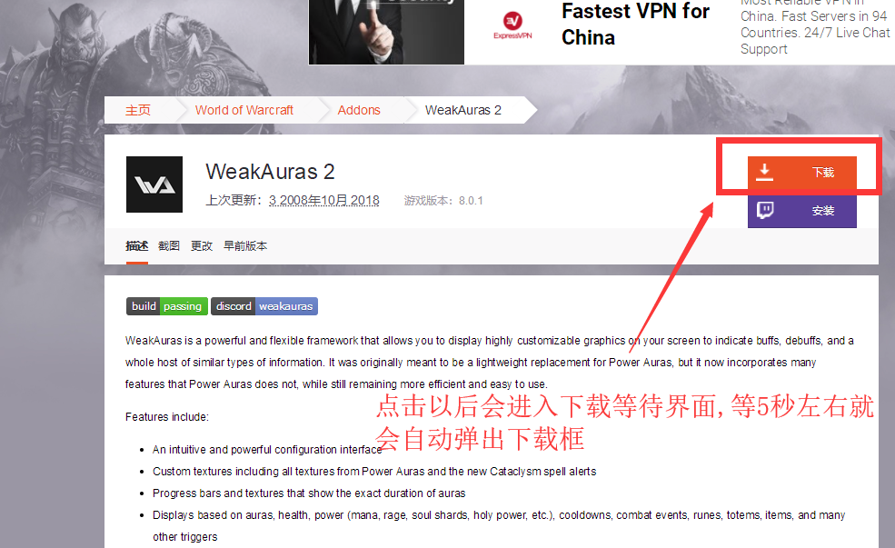

---

---

+ # 第二步安装wa
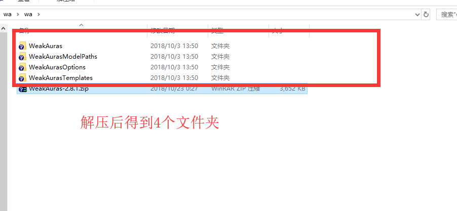 
---
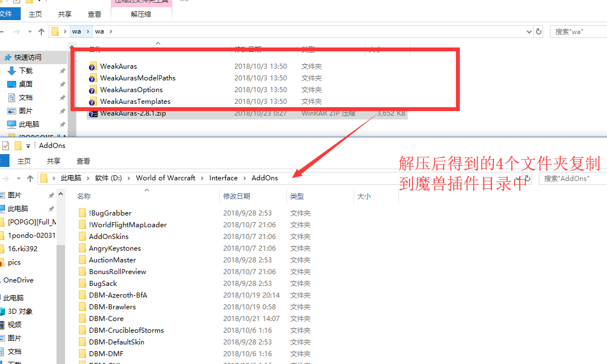 

---

---

+ # 第三步进入游戏测试wa
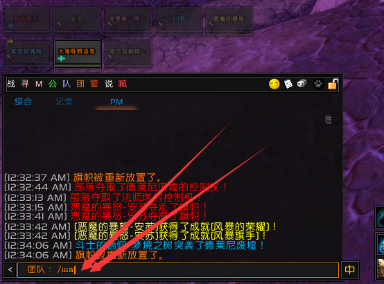 
+ # 成功出现了wa界面!
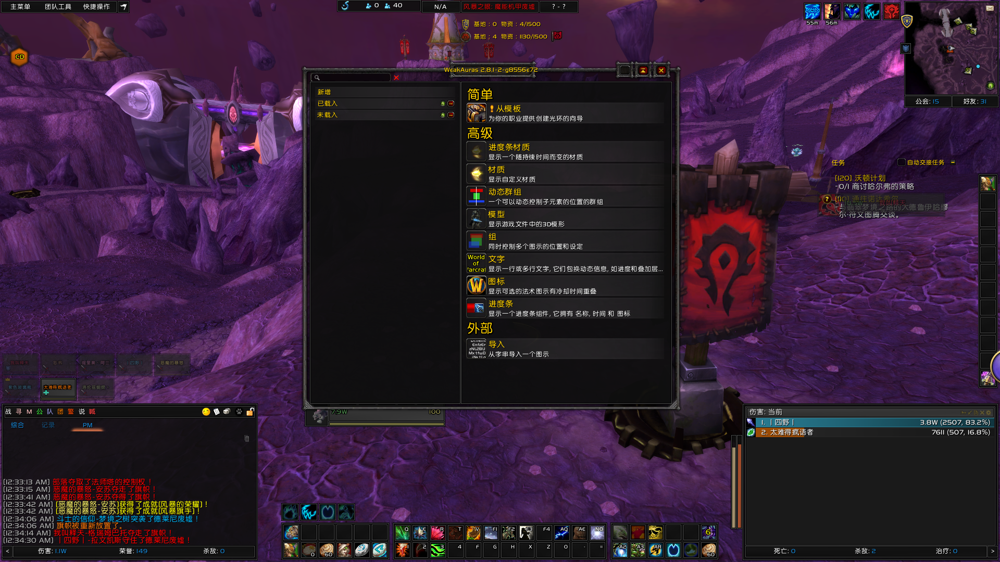 

---

---

+ # 第四步导入字符串
+ # 这里我们已一个广受好评的字符串为例,NGA有这个字符串汉化版,这里教程就不涉及汉化版了~

--- 

+ # [T22 Uldir Auras,也是目前奥杜尔字符串评分最高的](https://wago.io/bfaraid1) 

+ # 打开导入界面
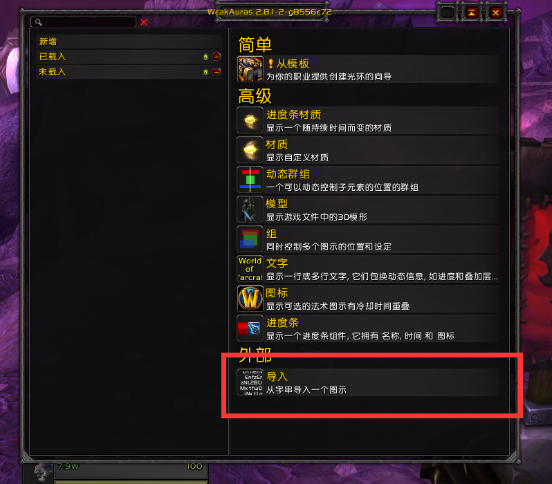 

+ # 复制网页中的字符串
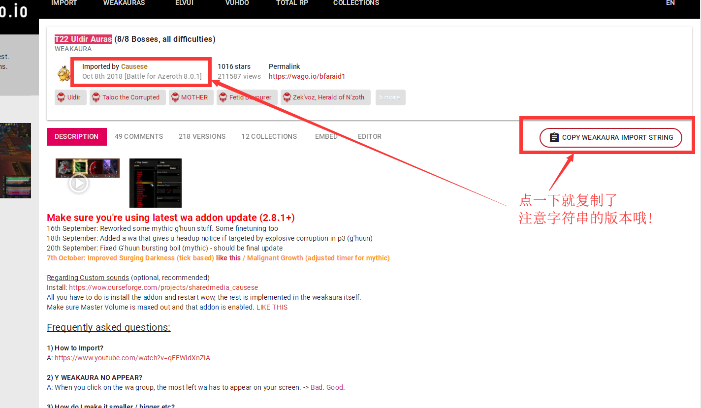 

+ # 粘贴进wa
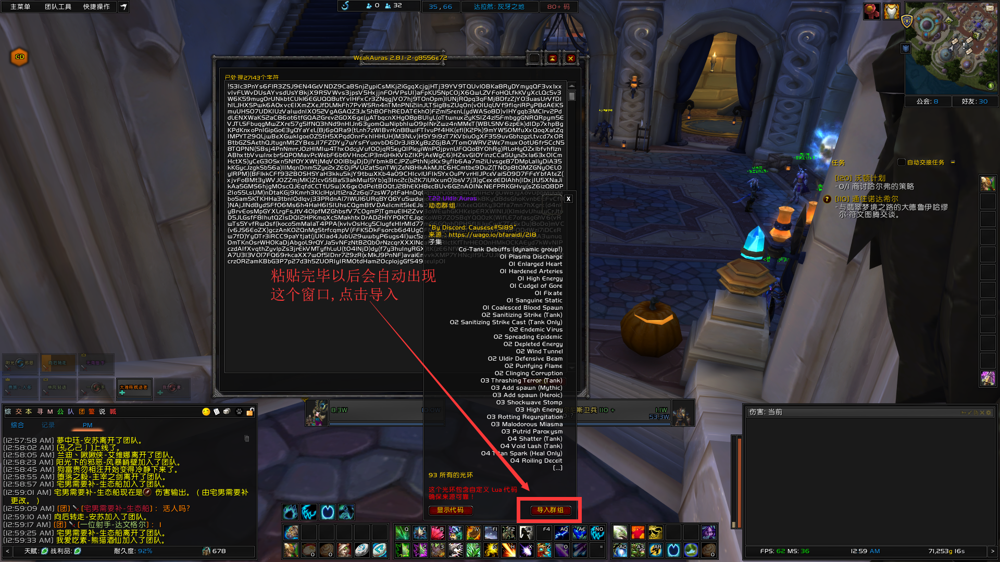 
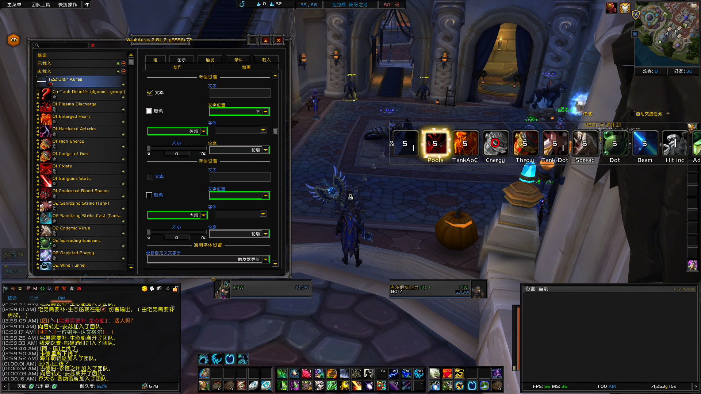 
+ # 调整大小
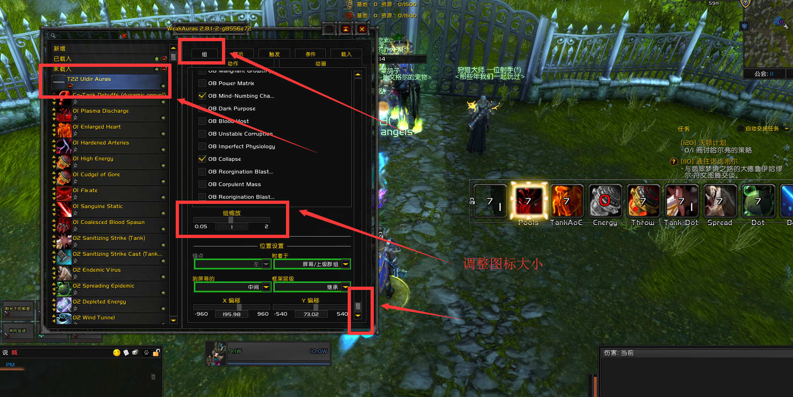 
+ # 禁用某一套wa
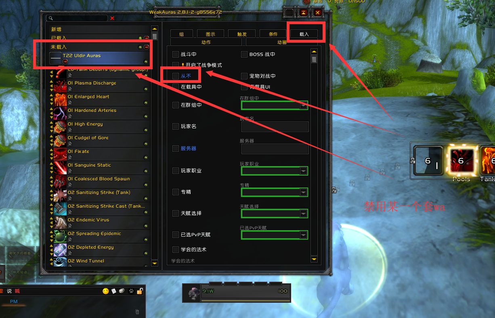 

---

---

+ # 如何自己找到好的字符串,待更新

---
