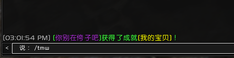

# 这是一份月神殿的tmw插件导入字符串教程

--- 

+ # [TellMeWhen官方下载地址](../README.md "点我下载") 

+ # 第一步下载--2选1,官方和我提供的
+ # 下载流程可以参考wa教程贴!
+ # [TellMeWhen官方下载地址](https://www.curseforge.com/wow/addons/tellmewhen "点我下载") 
+ # [我提供的TellMeWhen-8.5.4版本下载](https://github.com/zxsean/Moon-Temple-WA/raw/master/wa/WeakAuras-2.8.1.zip) 

---

---

+ # 第二步安装tmw
+ # 也请参考wa教程贴

---

---

+ # 第三步进入游戏测试tmw
 
+ # 成功出现了tmw界面!
 

---

---

+ # 第四步导入字符串

+ # 打开导入界面
 

+ # 复制网页中的字符串
 

+ # 粘贴进tmw
 
 
 

+ # 调整大小
 

+ # 删除不用的tmw字符串
 
 

---
